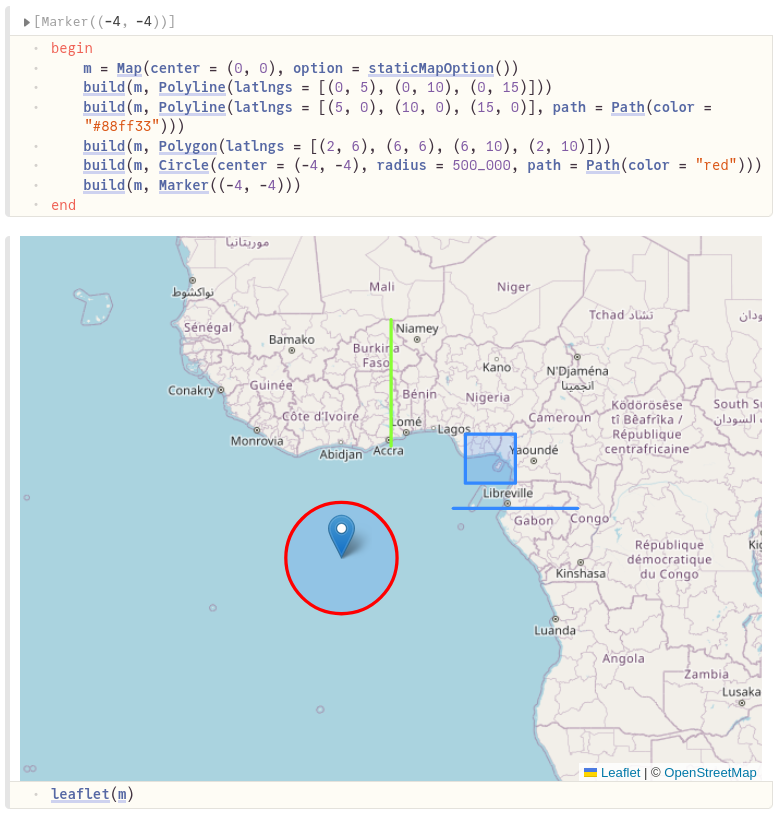

# LeafletPluto.jl

[](https://github.com/florianfmmartin/LeafletPluto.jl/actions/workflows/CI.yml?query=branch%3Amain)

A simple map widget for Pluto.jl notebooks. It creates a map using [Leaflet](https://leafletjs.com/).



## Prerequisites

LeafletPluto is a package for [Julia](https://julialang.org/). It is is designed to be used in [Pluto notebooks](https://github.com/fonsp/Pluto.jl). If you are using Pluto, you're ready to use this package!

## Usage

Basic usage looks like this:

```julia
using LeafletPluto

# create a map
m = Map(center = (0, 0), option = staticMapOption())

# add a few elements to it
build(m, Polyline(latlngs = [(0, 5), (0, 10), (0, 15)]))
build(m, Polyline(latlngs = [(5, 0), (10, 0), (15, 0)], path = Path(color = "#88ff33")))
build(m, Polygon(latlngs = [(2, 6), (6, 6), (6, 10), (2, 10)]))
build(m, Circle(center = (-4, -4), radius = 500_000, path = Path(color = "red")))
build(m, Marker((-4, -4)))

# display it
leaflet(m)
```

### Tile layer
*This is inspired from PlutoMapPicker.jl*

Maps use a _raster tile layer_ to show the actual map. This layer is built of images of the world map. To load in these tiles as needed, the map must request the tiles from an API.

The default setting will request tiles from [Open Street Map](https://openstreetmap.org), but you can change this setting. The package also includes some ready-to-go configurations for [Stadia Maps](https://stadiamaps.com/). For example:

```julia
Map(center=(0, 0), tile=stadia_tile_layers.outdoors)
```

You can also create a custom `TileLayer` to use a different server or make requests with an API key.

Please note that PlutoMapPicker & LeafletPluto are not affiliated with Open Street Map or Stadia Maps. The `TileLayer` configurations for these services are provided for convenience, but it is up to you whether the way you're using these services complies with their usage policy. See [Open Street Map's usage policy](https://operations.osmfoundation.org/policies/tiles/) and [Stadia Map's documentation](https://docs.stadiamaps.com/) for more information.

## Licence

This package is shared under an MIT licence. See [LICENSE](./LICENSE) for more information.

